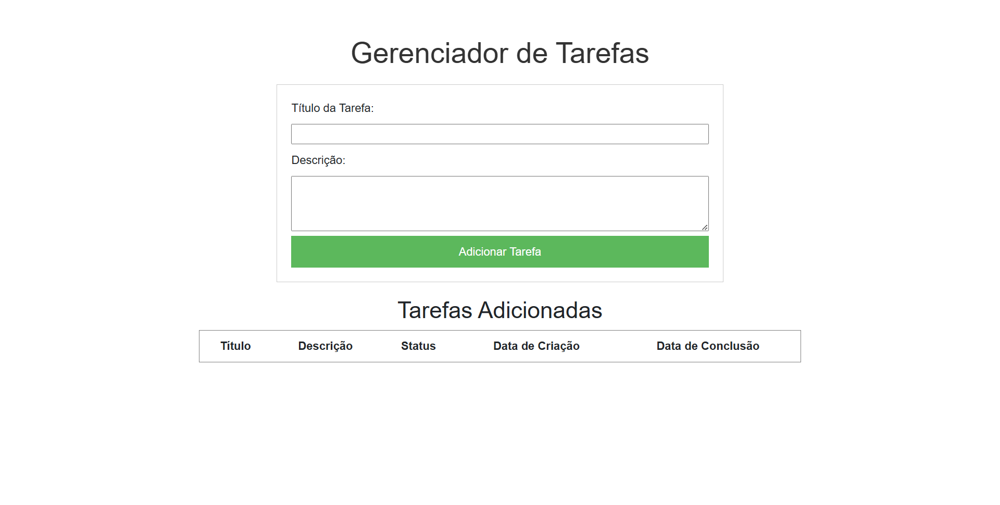
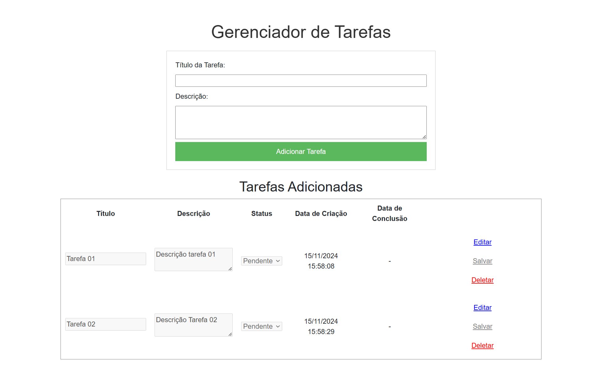
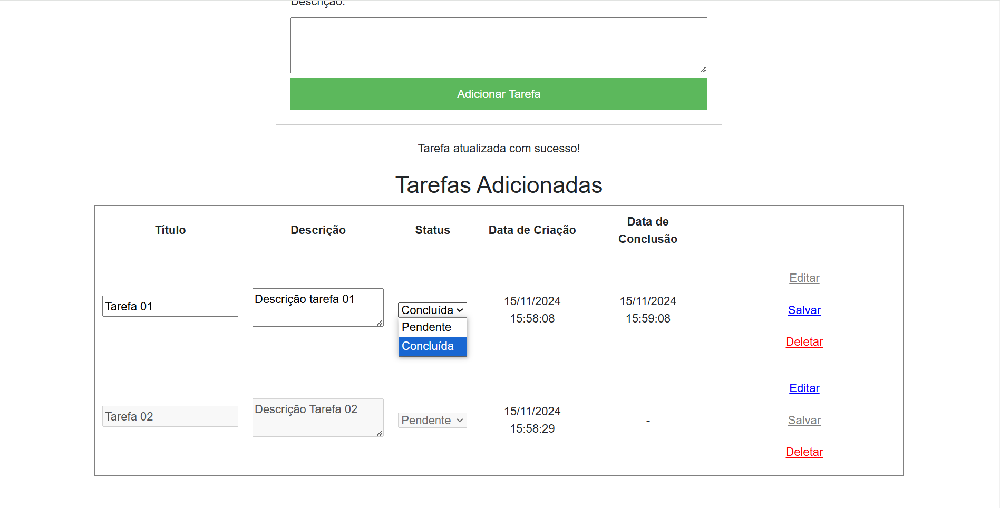
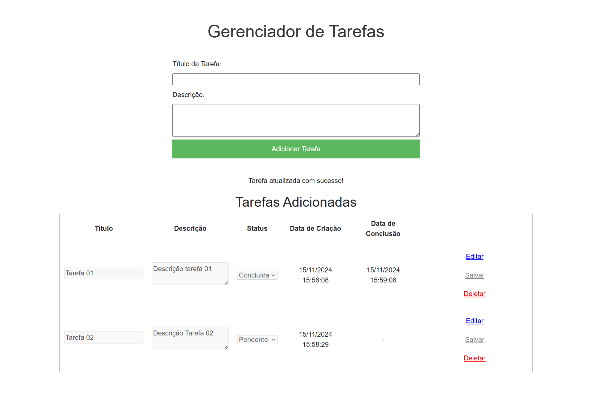

# Desafio Teclat

Este é um projeto Flask que utiliza PostgreSQL como banco de dados. Projeto focado em resolver desafio teste TeclaT.

## Estrutura do Projeto

- `app`: Contém o código fonte da aplicação Flask.
- `migrations/`: Diretório gerado por Alembic para armazenar scripts de migração do banco de dados.
- `Dockerfile`: Arquivo de configuração para construir a imagem Docker da aplicação.
- `docker-compose.yml`: Arquivo de configuração para definir e executar múltiplos contêineres Docker.
- `start.sh`: Script de inicialização da aplicação.
- `test_app.py`: Contém os testes unitários da aplicação.

## Pré-requisitos

Certifique-se de ter o Docker e o Docker Compose instalados em sua máquina. Você pode instalar o Docker seguindo as instruções [aqui](https://docs.docker.com/get-docker/) e o Docker Compose [aqui](https://docs.docker.com/compose/install/).

## Configuração e Inicialização

1. **Clone o repositório:**

   ```bash
   git clone https://github.com/david-luk4s/desafio_python.git
   cd desafio_python
    ```

2. **Executar projeto:**
    ```
    docker compose up --build
    ```

3. **Interface Web**
    ```
    http://127.0.0.1:5000
    ```

4. **Fotos do Projeto**



